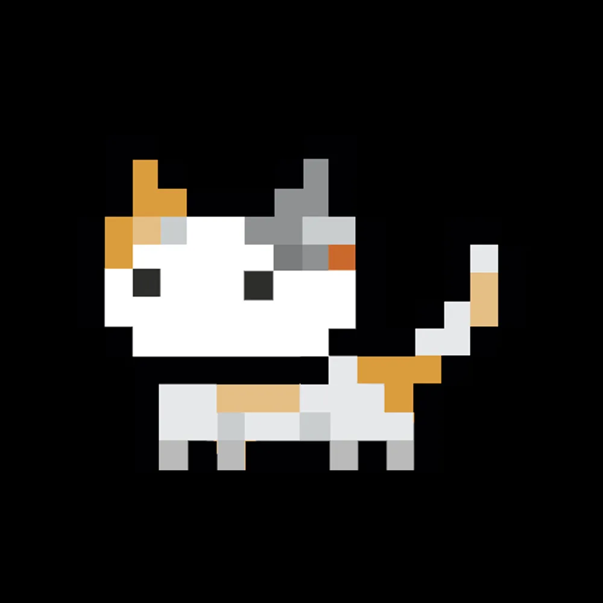

<div align="center">



# membercat.com

A high-quality website built for Membercat Studios, providing innovative Minecraft experiences and developer tools.

[](https://discord.gg/membercat)
[](LICENSE)

</div>

## 🚀 Features

-   Modern and responsive design
-   User authentication and profiles
-   Project showcase and discovery
-   Developer documentation
-   Community integration

## 🛠️ Tech Stack

### Frontend

-   [React](https://reactjs.org/) - UI library
-   [TailwindCSS](https://tailwindcss.com/) - Utility-first CSS framework
-   [Inertia.js](https://inertiajs.com/) - Modern monolithic applications

### Backend

-   [Laravel](https://laravel.com/) - PHP framework
-   [SQLite](https://www.sqlite.org/) - Database engine

## 📋 Prerequisites

Before you begin, ensure you have the following installed:

-   Node.js (v18 or higher)
-   PHP (v8.1 or higher)
-   Composer
-   Web Server (Apache, Nginx)
-   Database (SQLite, MySQL, PostgreSQL, etc.)

If you are using MySQL or PostgreSQL, make sure to set up the proper variables in your `.env` file.

## 🚦 Getting Started

1. **Clone the repository**

    ```sh
    git clone https://github.com/Membercat-Studios/membercat.com.git
    cd membercat.com
    ```

2. **Install dependencies**

    ```sh
    composer install
    npm install
    ```

3. **Set up environment**

    ```sh
    cp .env.example .env
    php artisan key:generate
    ```

4. **Start development servers**

    ```sh
    php artisan serve
    npm run dev
    ```

    The application will be available at the URL defined in the `.env` file.

## 🤝 Contributing

We welcome contributions from the community! Here's how you can help:

### Development Process

1. **Fork the Repository**

    - Create a fork of this repository to your GitHub account

2. **Clone Your Fork**

    ```sh
    git clone https://github.com/Membercat-Studios/membercat.com.git
    ```

3. **Create a Branch**

    ```sh
    git checkout -b feature/your-feature-name
    ```

4. **Make Your Changes**

    - Write clean, maintainable code
    - Follow our coding standards
    - Add tests if applicable

5. **Commit Your Changes**

    ```sh
    git commit -m "feat: add some feature"
    ```

    We follow [Conventional Commits](https://www.conventionalcommits.org/) specification

6. **Push to GitHub**

    ```sh
    git push origin feature/your-feature-name
    ```

7. **Submit a Pull Request**
    - Provide a clear description of your changes
    - Link any related issues

### Code Standards

-   Follow PSR-12 coding standard for PHP
-   Use ESLint configuration for JavaScript
-   Write meaningful commit messages
-   Keep code modular and DRY
-   Add comments for complex logic

### Running Tests

```sh
php artisan test
```

or Node.js testing:

```sh
npm run test
```

## 📝 License

This project is proprietary software. All rights reserved by Membercat Studios.

-   Private use is permitted
-   Contributions via pull requests are welcome
-   Public use, hosting, or distribution requires explicit permission
-   See the [LICENSE](LICENSE) file for details

## ⭐ Acknowledgements

-   KasaiSora and his YouTube channel.
-   The Minecraft modding and plugin community.
-   The team at Membercat Studios, for being so dedicated and hard-working.

---

<div align="center">

Made with ❤️ by [Membercat Studios](https://membercat.com)

</div>
